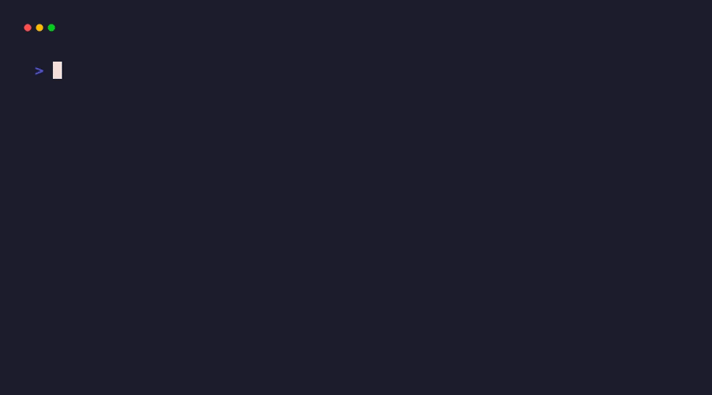

# weightlens

[](https://pypi.org/project/weightlens/)
[](https://github.com/akshathmangudi/weightlens/actions)
[]()
[](https://opensource.org/licenses/MIT)

Analyze ML checkpoint weights without loading them into memory. Detect corrupted weights, dead layers, exploding variance, and statistical anomalies across PyTorch, Safetensors, and DCP checkpoints.



## Quick start

```bash
pip install weightlens
lens analyze model.pth
```

```console
$ lens analyze artifacts/checkpoints/corrupted_spike.pth

Statistics for corrupted_spike.pth
================================================================================
file_size_bytes:    1,078,077
loadable:           true
is_empty:           false
tensor_count:       8
total_params:       268,650
corruption_flags:   none

Global Stats
================================================================================
mean:                    3.722
std:                     1929.327
p99:                     0.048
median_layer_variance:   0.000
median_layer_norm:       0.019

Diagnostics (2)
================================================================================
   Severity   Rule            Layer           Message
   warn       exploding-var   conv2.weight    variance_ratio=3.78e14 >= 10.0
   error      extreme-spike   conv2.weight    spike_ratio=20682379 >= 100.0

FAILED — 1 error, 1 warning
```

## Why weightlens?

`torch.load()` deserializes the entire checkpoint into memory. You cannot inspect a single tensor without paying the full memory cost first.

Weightlens streams tensors one at a time instead. For safetensors, the file is memory-mapped directly and tensor data is never copied into a buffer. Statistics run through Welford's online algorithm in 1M-element chunks, so peak RSS stays bounded by chunk size rather than checkpoint size.

Safetensors checkpoints are byte-ranged from S3/GCS directly. Only tensor bytes are fetched and the file is never downloaded. PyTorch checkpoints download to a local cache first, then stream through the same chunked pipeline. Format detection and streaming are automatic.

## Performance

Benchmarked on a MacBook M-series with NVMe SSD. All numbers measured with `/usr/bin/time -l` on real model checkpoints.

| Checkpoint | Format | Size | Tensors | Params | Time | Peak RSS |
|-----------|--------|------|---------|--------|------|-----------|
| ToyNet (demo) | .pth | 1 MB | 8 | 269K | 0.5s | 237 MB |
| SqueezeNet 1.1 | .pth | 5 MB | 52 | 1.2M | 0.6s | 237 MB |
| ResNet-18 | .pth | 45 MB | 102 | 11.7M | 0.8s | 324 MB |
| VGG-19 | .pth | 548 MB | 38 | 143.7M | 1.7s | 940 MB |
| Phi-2 | .index.json (sharded) | 5.6 GB | 453 | 2.8B | 28.6s | 659 MB |

Time is I/O-bound on local NVMe. Phi-2 was a cold read across 2 safetensors shards. Peak RSS remained constant at ~659 MB regardless of file size due to memory-mapped tensor views and chunked processing. Remote first-run times include credential chain resolution. Use `--num-workers` to parallelize stats computation on larger models.

## Features

- Detect dead layers (99.99%+ zeros), NaN floods, extreme spikes (100x above p99), exploding variance (10x above median), abnormal norms (5 IQR-scaled deviations from median)
- Stream one tensor at a time: Welford variance, incremental histogram, histogram-based p99. One pass, no buffering.
- Memory bounded by chunk size (1M elements, about 2-8 MB), not file size
- Read safetensors from S3 or GCS via byte-range requests. No full download needed.
- Identical results across .pth, .safetensors, and DCP formats
- Diagnostic thresholds are conservative to avoid false positives on typical architectures. Each rule is configurable: `--variance-threshold`, `--spike-threshold`, `--norm-threshold`, `--sparsity-threshold`

## Formats

| Format | Extension | Remote | Loading |
|--------|----------|--------|---------|
| PyTorch | .pth, .pt | Download to cache | Pickle deserialization + chunked stats |
| Safetensors | .safetensors | Byte-range | Memory-mapped views |
| Safetensors sharded | .index.json | Byte-range | Memory-mapped views per shard |
| DCP | directory | Offline | Byte-offset reads from shard files |

```bash
lens analyze model.pth
lens analyze model.safetensors
lens analyze model.safetensors.index.json
lens analyze checkpoint_dir --format dcp
```

Remote checkpoints use your existing AWS or GCS credentials. PyTorch CDN URLs download to a local cache first. Safetensors URLs use byte-range reads when the server supports Range headers:

```bash
pip install weightlens[remote]
lens analyze https://download.pytorch.org/models/resnet18-f37072fd.pth
lens analyze s3://bucket/model.safetensors
lens analyze s3://bucket/model.safetensors.index.json
lens analyze gs://bucket/model.safetensors
```

## Install

Python 3.11 or later.

```bash
pip install weightlens
pip install weightlens[s3]     # AWS S3
pip install weightlens[gcs]    # Google Cloud Storage
```

## Security

DCP metadata pickles are loaded through a blocklist-based unpickler that stubs dangerous modules. PyTorch loading uses `weights_only=True` with no unsafe fallback; old-format .pth files that reject mmap fall back to non-mmap load (not unsafe unpickling). Path traversal is blocked in shard filenames for DCP and safetensors. Byte-range reads verify returned length. Remote downloads are capped at 50 GB.

## License

MIT
